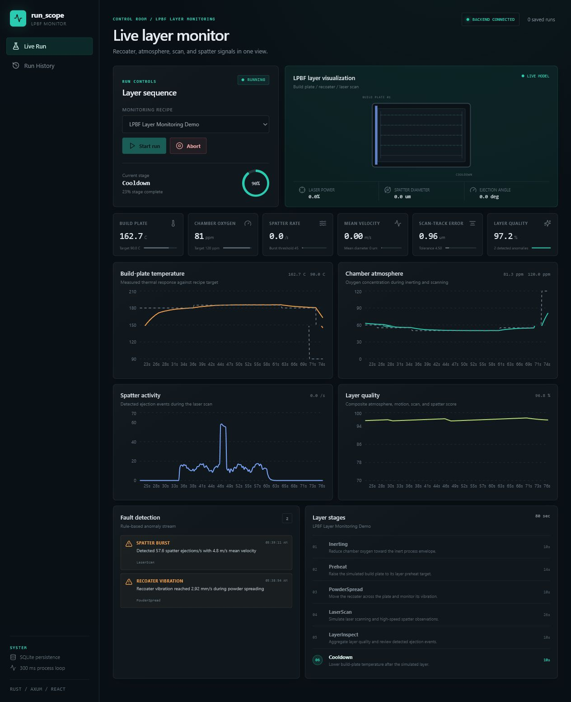
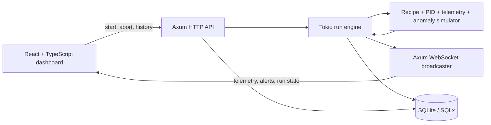

# run_scope

run_scope is a real-time LPBF layer-monitoring demo with live telemetry
streaming, recipe sequencing, control-loop simulation, anomaly detection,
run-history storage, and an engineering dashboard.



## Background

LPBF process analysis often combines high-speed imaging with derived
measurements such as spatter velocity, size, and ejection angle. Those
measurements are typically reviewed after acquisition.

run_scope models the surrounding monitoring system: layer sequencing, live
telemetry, anomaly detection, and persisted run review.

All telemetry in this repository is simulated. It does not contain original
laboratory data and does not control a physical LPBF machine.

## Features

- Real-time telemetry streaming over WebSockets
- Recipe-based LPBF layer sequencer with stage progress
- PID-style build-plate temperature simulation
- Stateful oxygen, recoater, laser, scan-track, and spatter signals
- Simulated spatter rate, mean velocity, diameter, and ejection angle
- Rule-based anomaly detection with warning and critical severity
- SQLite run summaries, alerts, and sampled telemetry
- React and TypeScript engineering control dashboard
- Rust, Axum, Tokio, and SQLx backend
- Health, metrics, history, detail, and telemetry APIs

## Demo Scenario

The included **LPBF Layer Monitoring Demo** simulates one additive-manufacturing
layer:

1. `Inerting`
2. `Preheat`
3. `PowderSpread`
4. `LaserScan`
5. `LayerInspect`
6. `Cooldown`

During `PowderSpread`, a simulated recoater vibration event creates a warning.
During `LaserScan`, a burst in detected spatter rate produces a second warning
and raises the velocity, diameter, and angle signals.

## Architecture



See [docs/architecture.md](docs/architecture.md) for the component and data-flow
details.

## Tech Stack

**Backend:** Rust, Axum, Tokio, SQLx, SQLite, Serde, tower-http  
**Frontend:** React, TypeScript, Vite, Recharts, Browser WebSocket API  
**Testing:** Rust unit tests plus TypeScript production build validation

## Running Locally

Prerequisites:

- Rust stable toolchain
- Node.js 22 or newer
- npm

Install dependencies:

```bash
./scripts/setup.sh
```

On Windows PowerShell:

```powershell
.\scripts\setup.ps1
```

Start the backend:

```bash
cd backend
cargo run
```

Start the frontend in another terminal:

```bash
cd frontend
npm install
npm run dev
```

Open [http://localhost:5173](http://localhost:5173). The backend listens on
[http://localhost:8080](http://localhost:8080).

Use `./scripts/dev.sh` on macOS or Linux, or `.\scripts\dev.ps1` in Windows
PowerShell, to start both services.

## API

| Method | Endpoint | Purpose |
| --- | --- | --- |
| `GET` | `/health` | Service status and uptime |
| `GET` | `/api/recipes` | Available process recipes |
| `POST` | `/api/runs/start` | Start a simulated run |
| `POST` | `/api/runs/{id}/abort` | Abort the active run |
| `GET` | `/api/runs` | Run history |
| `GET` | `/api/runs/{id}` | Run summary and alerts |
| `GET` | `/api/runs/{id}/telemetry` | Stored telemetry samples |
| `GET` | `/api/metrics` | Simple service metrics |
| `GET` | `/ws/telemetry` | Live WebSocket stream |

## Testing

```bash
cd backend
cargo fmt --check
cargo test
cargo clippy --all-targets --all-features -- -D warnings
```

```bash
cd frontend
npm run build
```

The backend tests cover PID response, recipe sequencing, anomaly severity, and
bounded continuous telemetry.

## Future Work

- High-speed camera or vision-pipeline ingestion
- Calibrated machine-sensor adapters and hardware integration
- Recorded-run playback and side-by-side layer comparison
- Statistical or learned anomaly models trained on validated data
- Prometheus and Grafana integration
- More advanced control algorithms

## License

[MIT](LICENSE)
