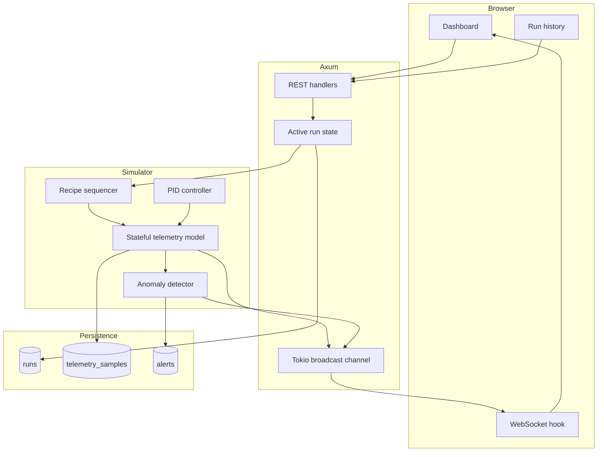

# run_scope Architecture

run_scope is organized as a small full-stack control system. The backend owns
process time, simulation state, fault decisions, and persistence. The frontend
is a read-heavy operator surface that issues run commands and visualizes the
backend's state.

## Runtime Components



## Backend Boundaries

- `app.rs` constructs routing and shared application state.
- `api.rs` owns HTTP handlers and the asynchronous run lifecycle.
- `ws.rs` upgrades clients and forwards broadcast messages.
- `db.rs` creates SQLite and runs embedded SQLx migrations.
- `models.rs` defines API, persistence, telemetry, and WebSocket contracts.
- `simulator/recipe.rs` models stages and deterministic progression.
- `simulator/pid.rs` implements bounded PID-style control.
- `simulator/telemetry.rs` updates continuous process variables.
- `simulator/anomaly.rs` applies stateful fault rules.
- `simulator/engine.rs` combines those modules into one simulation tick.

## Run Lifecycle

1. `POST /api/runs/start` validates the recipe and enforces one active run.
2. A run row is inserted and a Tokio task starts at a 300 ms cadence.
3. Each tick advances continuous process state and recipe time.
4. Telemetry and run-state messages are broadcast to every WebSocket client.
5. Telemetry is sampled into SQLite approximately once per second.
6. Anomalies are persisted and broadcast immediately.
7. Completion, abort, or a critical fault finalizes the run summary.
8. The history endpoints expose the durable result and sampled signal trace.

## WebSocket Contract

Messages use a tagged envelope:

```json
{
  "type": "telemetry",
  "data": {
    "run_id": "7fd...",
    "stage": "LaserScan",
    "build_plate_temperature_c": 183.7,
    "chamber_oxygen_ppm": 52.4,
    "spatter_rate_per_s": 54.8,
    "mean_spatter_velocity_m_s": 4.7,
    "status": "running"
  }
}
```

The other message types are `alert` and `run_state`. The frontend maintains a
bounded in-memory chart window and treats SQLite as the source for completed
run review.

## Design Constraints

- One active run keeps control and abort semantics explicit.
- SQLite provides local persistence without a separate database service.
- Rule-based anomalies are inspectable and testable.
- The simulator has continuous state; values are not regenerated independently
  on every tick.
- LPBF and spatter values are synthetic rather than validated machine physics.
- Authentication and cloud infrastructure are outside the current scope.
